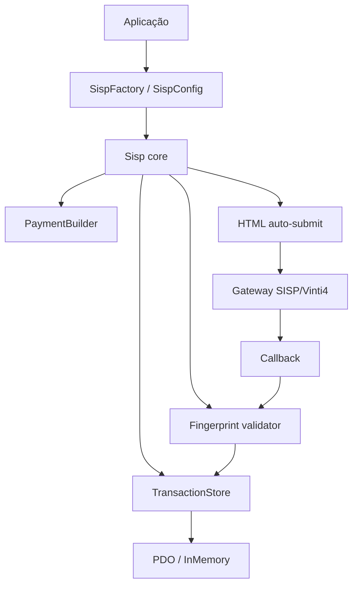

# Arquitectura

O pacote separa o domínio SISP/Vinti4 das integrações de framework. O core não
depende de Laravel, Symfony, Yii2, HTTP do framework ou uma base de dados
específica.

## Camadas

- `Domain`: objectos de valor, estados, códigos e montantes.
- `Contract`: portas para persistência e futuras integrações externas.
- `Application`: builders e acções de caso de uso.
- `Infrastructure`: fingerprints, HTML, PDO e suporte operacional.
- `Bridge`: adaptadores Laravel, Symfony e Yii2.

As bridges não contêm regra de negócio. Elas apenas convertem configuração do
framework para `SispConfig` e registam `Kowts\Sisp\Sisp` no container.

## Decisões

- fingerprints e montantes ficam no core para terem o mesmo comportamento em
  PHP puro e em frameworks;
- persistência é opcional, mas recomendada em produção;
- `SispSchema` escolhe SQL para SQLite, MySQL/MariaDB, PostgreSQL e SQL Server a partir do
  driver PDO;
- os quatro motores são validados no CI: SQLite em memória, MySQL, PostgreSQL e SQL Server
  em serviços efémeros.

## Limites de responsabilidade

O core constrói pedidos, valida callbacks e persiste o ciclo técnico da
transação. A aplicação continua responsável por encomendas, autorização de
utilizadores, stock, documentos, comunicação ao cliente e regras de entrega.
As bridges apenas adaptam configuração e injeção de dependências; não devem
introduzir comportamento de pagamento diferente do PHP puro.
